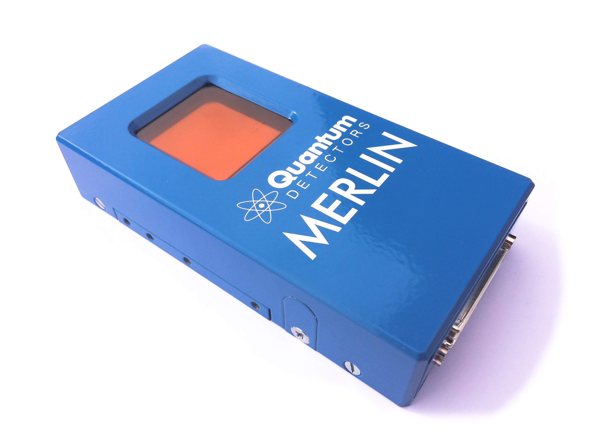

.. _camera-merlin:

Merlin camera
-------------




Introduction
````````````

The Merlin Medipix3Rx Quad Readout detector system from Diamond Light Source Ltd is a photon counting soild state pixel detector with a silicon sensor.

The Lima module has only been tested  in a 2 x 2 configuration, but is available in a 4 x 1 configuration

There is extensive documentation :ref: `Merlin_and_Medipix3_Documentation_v0.7.pdf`

Prerequisite
````````````
The Merlin detector system is based on a National Instruments FlexRIO PXI FPGA system.
It incorporates an embedded PC running Windows with a LabView graphical user interface, incorporating a socket server, which this plugin communicates with.
This program must be running prior to starting Lima.

Installation & Module configuration
```````````````````````````````````

The minimum configuration file is *config.inc* :

.. code-block:: sh

  COMPILE_CORE=1
  COMPILE_SIMULATOR=0
  COMPILE_SPS_IMAGE=1
  COMPILE_ESPIA=0
  COMPILE_FRELON=0
  COMPILE_MAXIPIX=0
  COMPILE_PILATUS=0
  COMPILE_POINTGREY=0
  COMPILE_BASLER=0
  COMPILE_MERLIN=1
  COMPILE_CBF_SAVING=0
  export COMPILE_CORE COMPILE_SPS_IMAGE COMPILE_SIMULATOR \
         COMPILE_ESPIA COMPILE_FRELON COMPILE_MAXIPIX COMPILE_PILATUS \
         COMPILE_POINTGREY COMPILE_MERLIN COMPILE_BASLER COMPILE_CBF_SAVING

-  start the compilation :ref:`linux_compilation`

-  finally for the Tango server installation :ref:`tango_installation`

Initialisation and Capabilities
```````````````````````````````
This plugin has been implemented for a standard LIMA framework

Camera initialisation
......................

The camera has to be initialized using the MerlinCamera class. The constructor requires the hostname of the detector system. 

Std capabilities
................

This plugin has been implemented with the mandatory capabilites, with some limitations due to the camera server implementation.

* HwDetInfo

 The detector is set to full image size at startup which means a binning of 1x1. There is no hardware binning

* HwSync

 - The supported trigger modes are:

   - IntTrig
   - IntTrigMult
   - ExtTrigSingle
   - ExtTrigMult
 
Testing
````````````
This is a simple python test program:

.. code-block:: python

  from Lima import Merlin
  from Lima import Core
  import time

  camera = Merlin.Camera('<hostname>')
  interface = Merlin.Interface(camera)
  control = Core.CtControl(interface)

  acq = control.acquisition()

  # check its OK
  print camera.getDetectorType()
  print camera.getDetectorModel()
  print camera.getSoftwareVersion()

  nframes=5
  acqtime=3.0
  # setting new file parameters and autosaving mode
  saving=control.saving()

  saving.setDirectory("/home/grm84/data")
  saving.setFramesPerFile(nframes)
  saving.setFormat(Core.CtSaving.HDF5)
  saving.setPrefix("merlin_")
  saving.setSuffix(".hdf")
  saving.setSavingMode(Core.CtSaving.AutoFrame)
  saving.setOverwritePolicy(Core.CtSaving.Append)

  # do acquisition
  acq=control.acquisition()
  acq.setAcqExpoTime(acqtime)
  acq.setAcqNbFrames(nframes) 
  
  control.prepareAcq()
  control.startAcq()

  # wait for last image (#4) ready
  lastimg = control.getStatus().ImageCounters.LastImageReady
  while lastimg !=nframes-1:
    time.sleep(0.01)
    lastimg = control.getStatus().ImageCounters.LastImageReady
 
  # read the first image
  im0 = control.ReadImage(0)
